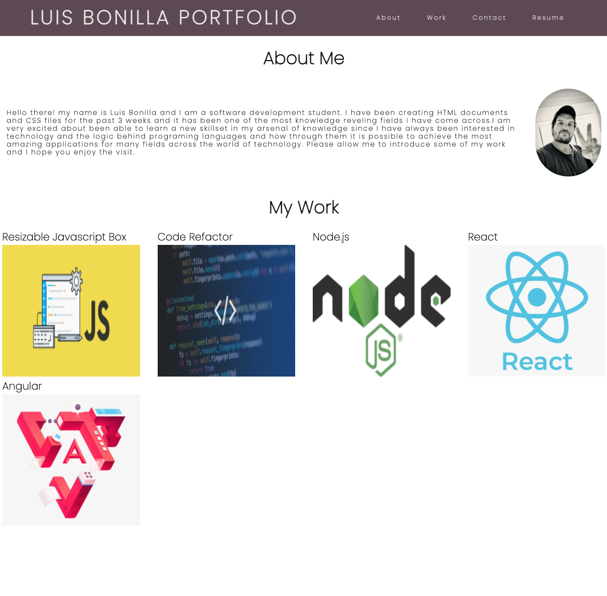

# Homework One

## Overview:

The purpose of this assignment was to create a portfolio website highlighting the developed applications.

## Implementation Details

1. Incorporation of HTML file, stucturing the entire document while following semantics.

2. Consolidated redundancy in CSS file of some of the styling properties by grouping selector types under the same conditions.

3. implementation of new CSS properties (grid section) for displaying the portfolio content in a more structured way.

## Screenshot

## Deployed Application

Please follow the following link: https://luisbonilla89.github.io/Homework-2/.

# Lisence

MIT
